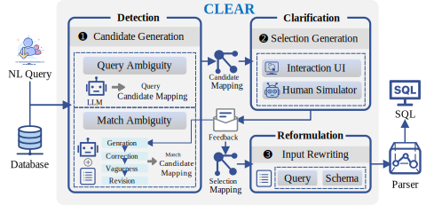

# CLEAR: A Parser-Independent Disambiguation Framework for NL2SQL

Code and dataset for paper: CLEAR: A Parser-Independent Disambiguation Framework for NL2SQL



## Dataset Download

Download datasets and move them to `./dataset/`. 

| Dataset                                               | Description                                                  |
| ----------------------------------------------------- | ------------------------------------------------------------ |
| [testzer0/AmbiQT](https://github.com/testzer0/AmbiQT) | Benchmarking and Improving Text-to-SQL Generation Under Ambiguity ([EMNLP 2023](https://arxiv.org/abs/2310.13659)) |
| [AMBROSIA](ambrosia-benchmark.github.io)              | AMBROSIA: A Benchmark for Parsing Ambiguous Questions into Database Queries ([arxiv](https://arxiv.org/abs/2406.19073)) |
| [BIRD]([BIRD-bench](https://bird-bench.github.io/))   | Can LLM Already Serve as A Database Interface? A BIg Bench for Large-Scale Database Grounded Text-to-SQLs([NeurIPS 2023](https://arxiv.org/abs/2305.03111)) |
| **CLAMBSQL**                                          | Our proposed benchmark for systematic evaluation for disambiguation. Instance and database can be avaliable [here](https://huggingface.co/datasets/mengxi123/CLAMBSQL). |

#### Json Format for CLAMBSQL

Each example contains the following fields:

`index`: Index of the example.

`db_id`: Database name of the example.

`ambig_type`: The ambiguity type of the example.

`question`: Ambiguous question of the example.

`schema_without_content`: The dababase schema extraction without db content.

`schema_with_content`: The dababase schema extraction with db content.

`ambiguous_queries`: All possible SQL queries to answer the question.

`gold_ambiguity`: Gold candidate mapping for the ambiguity.

`clarification_context`: Natural language feedback for ambiguity clarification.

`clear_ambiguity`: Gold selection mapping for ambiguity clarification.

`gold_query`: The gold SQL parse of the actual intent of question, which corresponds to the clarification.

```json
{
    "index": 0,
    "db_id": "world_1",
    "ambig_type": "column",
    "db_file": "column/world_1/world_1.sqlite",
    "question": "What is the continent name which Anguilla belongs to?",
    "schema_without_content": "city : countrycode , name , population , district , id  | sqlite_sequence : name , seq  | country : capital , headofstate , localname , lifeexpectancy , gnp , gnpold , continent_name , code , surfacearea , population , code2 , mainland , region , indepyear , governmentform , name  | countrylanguage : language , percentage , isofficial , countrycode",
    "schema_with_content": "city : countrycode (\"DMA\", \"NER\", \"NLD\"), name (\"Scottsdale\", \"Taxco de Alarcón\", \"Wellington\"), population (89423, 245772, 315382), district (\"Borsod-Abaúj-Zemplén\", \"West Java\", \"Midi-Pyrénées\"), id (3788, 3629, 340) | sqlite_sequence : name (\"city\"), seq (4079) | country : capital (2973, 3243, 3212), headofstate (\"Hamad ibn Isa al-Khalifa\", None, \"Vicente Fox Quesada\"), localname (\"México\", \"Makedonija\", \"Sverige\"), lifeexpectancy (77.6, 77.0, 54.8), gnp (340238.0, 6041.0, 211860.0), gnpold (573.0, 360478.0, 2141.0), continent_name (\"Europe\", \"Oceania\", \"South America\"), code (\"VCT\", \"SYR\", \"NFK\"), surfacearea (774815.0, 96.0, 1862.0), population (453000, 50456000, 9586000), code2 (\"AD\", \"ID\", \"SK\"), mainland (\"Europe\", \"Oceania\", \"South America\"), region (\"Eastern Europe\", \"Polynesia\", \"Polynesia\"), indepyear (836, 1143, 1581), governmentform (\"Islamic Emirate\", \"Occupied by Marocco\", \"Constitutional Monarchy\"), name (\"French Polynesia\", \"Iran\", \"Chad\") | countrylanguage : language (\"Kanem-bornu\", \"Dari\", \"Yao\"), percentage (8.2, 14.0, 11.4), isofficial (\"T\", \"F\"), countrycode (\"SYC\", \"UMI\", \"LBY\")",
    "ambiguous_queries": [
        "select mainland from country where name = 'Anguilla'",
        "select continent_name from country where name = 'Anguilla'"
    ],
    "gold_ambiguity": {
        "match": "{\"continent\": [{\"country\": [\"mainland\"]}, {\"country\": [\"continent_name\"]}]}",
        "query": "{}"
    },
    "clarification_context": "\"continent\" refers to the schema \"country\".\"continent_name\"",
    "clear_ambiguity": "{\"continent\": {\"country\": [\"continent_name\"]}}",
    "gold_query": "select continent_name from country where name = 'Anguilla'"
}
```


## Run Disambiguation

Prepare the enviroment.

```shell
pip install -r requirements.txt
```

Create `.env` file and set the OpenAI config.

```
OPENAI_BASE_URL="xx"
OPENAI_API_KEY="xx"
```

Run the script. CLEAR can produce ambiguity representation (i.e., candidate mapping) and clear input (i.e., question and schema) of NL2SQL parsers.

```shell
python main_disambiguation \
	--dataset_name "clambsql" \
	--dev_path "./dataset/clambsql.json" \
	--db_root_path "./dataset/database" \
	--work_dir_path "./data/clambsql/" \
	--llm_model "gpt-4o" \
	--mapping_mode "all" \
	--schema_with_content true 
```

